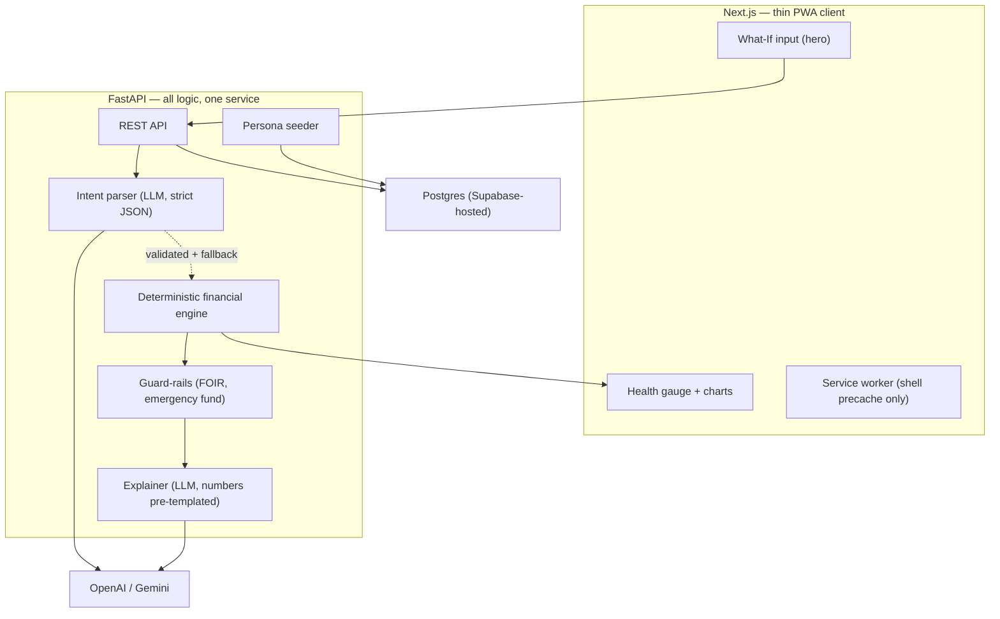

# CreditIn — Implementation Plan v2 (48-Hour Build)

> **Hackathon:** Code Build 1.0 (CoBuild) — Team Zero
> **Constraints:** ~48h wall clock · 2–3 devs, Python-strong · demo is the deliverable
> **Supersedes:** `implementation.md` (v1). v1 is retained as the product roadmap.

---

## 1. Why v2 Exists

v1 is a strong **product** plan and an unbuildable **hackathon** plan. Nothing is wrong with the
vision; the problem is arithmetic. Three devs over 48 hours yields roughly **70 person-hours**, and
that figure already has to absorb scaffolding, deploys, integration debugging, the pitch deck, and
at least one rehearsal. Real feature capacity is **~40 person-hours**.

v1's Phase 1 contains 15 items including auth, onboarding, a PWA service-worker caching matrix,
VAPID push infrastructure with a cron scheduler, a second scoring engine (the improvement plan),
and an SEO landing page. Auth plus onboarding alone is 8–10 hours. Push notification
infrastructure is 8–12 hours and is nearly undemoable on stage — you cannot wait for a scheduled
job to fire during a five-minute slot.

v2 changes one thing structurally: **it deletes most of Phase 1.** What remains is four features
that together tell the entire story, plus a demo path that survives a dead LLM and hotel wifi.

Everything cut is preserved in §11 as a roadmap slide. Judges reward a tight working demo plus a
credible roadmap far more than fifteen half-wired features.

---

## 2. Locked Scope

**Feature freeze is at hour 36. No exceptions, no "quick additions."**

### In (build these four)

| # | Feature | Why it survives the cut |
|---|---------|------------------------|
| 1 | **Financial Health Score** (0–100, 6 components) | The "understand" hook. Gives every simulation something to move. |
| 2 | **What-If Engine** — 3 scenarios: pay debt, take loan, close card | The entire product thesis. Nothing else matters if this doesn't work. |
| 3 | **Debt Payoff Optimizer** — Avalanche / Snowball / Balanced | The visual wow. Sliders + timeline chart. Pure deterministic math, zero LLM risk. |
| 4 | **Demo Personas** — 3 seeded profiles, no login required | Demo safety net *and* the virality story. Judges try it in 5 seconds. |

**Emergency Fund Intelligence is not a feature — it is a guard-rail check inside #2.** Thirty
minutes of work, and it is the highest-trust moment in the demo (see §9). Do not let it grow into
a page.

### Out (moved to roadmap)

Push notifications · VAPID/cron infrastructure · offline caching matrix · background sync ·
periodic background fetch · Supabase Auth (Google OAuth + Email OTP) · credit report PDF parsing ·
Credit Report Detective · BNPL Tracker · Asset Purchase Simulator · Pre-Approval Odds ·
Improvement Plan generator · Credit Protection alerts · Dispute workflow · Marketplace ·
SEO landing page · custom install banner · Turborepo

### PWA: keep the claim, cut the cost

`manifest.json` + icons (192 / 512 / maskable) + a minimal service worker that precaches the app
shell + an offline banner. That is **90 minutes** and you can honestly say "installable PWA" and
demo Add to Home Screen. v1's six-row caching strategy table is two to three days of work for
zero demo value — an app whose entire purpose is server-side computation gains almost nothing
from offline support.

---

## 3. Corrected Architecture

### 3.1 What changed and why

**Supabase Auth is removed.** v1 keeps it for Google + Email OTP, which creates a JWT-verification
problem across two services, requires an OAuth consent screen and redirect URIs, needs SMTP for
OTP, and is historically the single most common demo-day failure (redirect URI mismatch on the
production domain). Replace with demo personas plus, if you want persistence, a FastAPI-issued
session cookie over email + password. Judges have never once audited a hackathon's auth.

**Supabase Edge Functions are removed — v1 contradicted itself here.** §3.2 states "Supabase
handles auth only — no Edge Functions" and decision #1 repeats it, but §4.4, the Phase 1
checklist, and the folder structure all depend on Edge Functions for the reminder cron. Since push
is cut, the contradiction dissolves. Supabase is now exactly one thing: **a Postgres connection
string.** Neon or Railway Postgres are equally fine.

**The AI provider is called only from the backend.** v1's architecture diagram draws
`NLInput --> AI`, which taken literally means the browser calls OpenAI/Gemini directly and your API
key ships to every visitor. All LLM calls go through FastAPI.

**Next.js is a thin client with zero server-side logic.** Given a Python-strong team, put every
decision in FastAPI and let Next.js render. Do not split logic across both — you will spend the
back half of the hackathon deciding where things live.

### 3.2 Revised diagram



### 3.3 Stack decisions, resolved

v1 left several choices open. Open choices cost hours mid-build, so they are closed here.

| Layer | v1 | v2 | Reason |
|-------|----|----|--------|
| Next.js | 14 | **16** (current) | 14 is two majors stale. `create-next-app` gives you 16 anyway. Note the breaking change: `params` and `searchParams` are **Promises** in 16 — `await` them. |
| Service worker | "next-pwa (Serwist)" | **`@serwist/next`** | These are different packages, not one. `next-pwa` is effectively unmaintained; Serwist is its actively maintained successor and the one that works with App Router. |
| Charts | "Recharts or Chart.js" | **Recharts** | Composes with React, easier slider binding for the optimizer. Decide now, not at hour 20. |
| Styling | Vanilla CSS + CSS Modules | **Tailwind** | Honest tradeoff: hand-rolled CSS plus glassmorphism, gradients, and micro-animations is the slowest possible path to a polished UI. If the team has strong CSS instincts, keep vanilla — but then cut the visual ambition to match. |
| Monorepo | Turborepo "(if using)" | **Two folders, one repo, no Turborepo** | A Python app in a JS monorepo gains nothing from Turborepo. Skip the tooling tax. |
| Auth | Supabase (Google + OTP) | **Personas + optional cookie session** | See §3.1. |

---

## 4. Financial Health Score — Full Spec

This is the largest gap in v1. The score is the product's core IP, it is listed as P1, and v1
defines **no weights, no formulas, and no bands** — only six component names. Two developers would
implement it two different ways. Everything below is deterministic, testable, and lives in
`services/health_score.py`.

v1's six components also omit **credit age** and **credit mix**, which together are roughly a
quarter of real bureau models — and credit age is precisely what makes v1's own flagship demo
question ("should I close my oldest card?") interesting. They are added back.

### 4.1 Weights (sum = 100)

| Component | Weight | Rationale |
|-----------|-------:|-----------|
| Credit Utilization | 25 | Strongest short-term lever; the thing what-ifs move most visibly |
| Payment Reliability | 25 | Largest factor in real bureau models |
| Debt Load (FOIR) | 20 | The over-leverage thesis from the pitch |
| Cash Flow | 12 | Monthly breathing room |
| Emergency Fund | 10 | Resilience; powers the guard-rail |
| Credit Age & Mix | 8 | **New in v2** — makes "close a card" answerable |

`CFHS = Σ(component_score × weight) / 100`, rounded to nearest integer.

**Bands:** 0–39 Critical · 40–54 At Risk · 55–69 Fair · 70–84 Healthy · 85–100 Strong

### 4.2 Component formulas

**Utilization** — `U = revolving_used / revolving_limit` (cards only; term loans excluded)

```
U ≤ 0.10          → 100
0.10 < U ≤ 0.30   → 100 − (U − 0.10) × 150      # U=0.30 → 70
0.30 < U ≤ 0.50   →  70 − (U − 0.30) × 150      # U=0.50 → 40
0.50 < U ≤ 0.75   →  40 − (U − 0.50) × 100      # U=0.75 → 15
U > 0.75          → max(0, 15 − (U − 0.75) × 60)  # U=1.00 → 0
```
Then: if **any single card** exceeds 0.90 utilization, subtract 10 (floor 0). Real bureaus punish a
maxed individual card even when the aggregate looks acceptable.

**Payment Reliability** — trailing 12 months, recency-weighted

```
base = 100 × (on_time_payments / total_payments)
  − 40  if any 30+ DPD in the last 3 months
  − 20  if any 30+ DPD in months 4–12
  − 60  if any 90+ DPD in the last 12 months
floor 0.  No history (thin file) → 60, not 100 — reliability is earned, not assumed.
```

**Debt Load (FOIR)** — `F = (EMIs + card minimums + rent) / monthly_income`

```
F ≤ 0.30          → 100
0.30 < F ≤ 0.40   → 100 − (F − 0.30) × 300      # F=0.40 → 70
0.40 < F ≤ 0.50   →  70 − (F − 0.40) × 400      # F=0.50 → 30
0.50 < F ≤ 0.65   → max(0, 30 − (F − 0.50) × 200)
F > 0.65          → 0
```

**Cash Flow** — `S = (income − expenses − obligations) / income`

```
S ≥ 0.30 → 100 ;  0 ≤ S < 0.30 → S × 333.33 ;  S < 0 → 0
```

*(Full marks at a 30% surplus, not 20%. Tuned during persona work — at 20% almost every realistic
profile scored 100 on this component, which made it carry no signal.)*

**Emergency Fund** — `M = emergency_fund / (monthly_expenses + obligations)`

```
M ≥ 6 → 100 ;  otherwise min(100, M × 16.67)
```

**Credit Age & Mix**

```
age  = min(100, avg_account_age_months / 84 × 100)     # 7 years = full marks
mix  = 40 (one account type) | 70 (two) | 100 (three+)
      types ∈ {credit_card, secured_loan, unsecured_loan}
component = 0.7 × age + 0.3 × mix
```

### 4.3 Named threshold constants

v1's pitch cites "15% of originations over-leveraged" but never defines over-leveraged. The engine
needs numbers, not adjectives. Put these in one module and reference them everywhere:

```python
FOIR_HEALTHY          = 0.40   # above this, decline new-credit recommendations
FOIR_OVERLEVERAGED    = 0.50   # the pitch's "over-leveraged" line
EMERGENCY_FLOOR_MONTHS = 3.0   # below this, block aggressive-payoff advice
UTILIZATION_TARGET     = 0.30
SINGLE_CARD_DANGER     = 0.90
```

---

## 5. What-If Scenario Math

Each scenario returns `{score_before, score_after, component_deltas, money_facts, guard_rails,
verdict}`. The explainer LLM receives that object and may only narrate it.

**A — Pay ₹X toward card C**

Reduce `C.balance` by X and, if paid from savings, reduce `emergency_fund` by X. Recompute
utilization, FOIR (the minimum payment falls), cash flow, and the emergency-fund component.
Interest saved is the difference between amortising C at its rate before and after.
Guard-rail: if post-payment coverage drops below `EMERGENCY_FLOOR_MONTHS`, surface the breach and
propose the largest X that keeps coverage at exactly 3 months.

**B — Take a loan of ₹P at r% for n months**

```
r_m = r / 12 / 100
EMI = P × r_m × (1+r_m)^n / ((1+r_m)^n − 1)
total_interest = EMI × n − P
```
Add EMI to obligations, recompute FOIR and cash flow. Credit mix may improve; average account age
falls; a hard enquiry is recorded.
Verdict is **approve** only if post-loan FOIR ≤ `FOIR_HEALTHY` **and** cash-flow surplus stays
positive **and** emergency coverage stays ≥ 3 months. Otherwise decline with the specific binding
constraint named.

**C — Close card C**

The important detail v1 does not state: **closing a card does not erase its balance.** The balance
migrates; only the limit disappears. So `revolving_limit` shrinks while `revolving_used` holds, and
utilization *rises*. If C is the oldest account, average age drops. If C was the only card, mix
drops.

This is the scenario where CreditIn says "don't" — the best beat in the demo.

### 5.1 Enforcing "the LLM never does arithmetic"

v1 states this principle but provides no mechanism, and the explainability layer is exactly where
it breaks: an LLM asked to narrate results will restate figures and can transpose digits or flip a
sign. Three cheap enforcements:

1. Hand the LLM **pre-formatted strings** (`"₹12,400"`), never raw floats.
2. Template every figure into the response; the LLM writes only the connective prose.
3. Assert that every numeral appearing in LLM output also appears in the engine payload. On
   mismatch, discard the prose and render the template. Roughly fifteen lines of code.

### 5.2 Intent parser reliability

The NL parser is the highest-variance thing on stage and v1 files it under `utils/nlp.py`, which
understates both its centrality and its fragility. Required:

- **Strict structured output** (JSON schema / function calling), parsed into a Pydantic model.
- **Keyword fast-path** matched *before* any network call, covering the demo queries. If a query
  matches, skip the LLM entirely — instant, free, offline-proof.
- **Guided-form fallback** on validation failure: "I read this as *take a loan* — is that right?"
  with the parsed fields editable. Never a stack trace, never a blank screen.
- **Latency budget of 2.5s** with a visible progress state. Past that, fall back to the form.
- Treat free text as **untrusted input**. It reaches an LLM prompt, so prompt injection applies;
  the same will be true of parsed PDF text later. Never place user or document content where system
  instructions live.

---

## 6. Golden Test Vectors

The deterministic engine is simultaneously the easiest thing to test and the worst thing to get
visibly wrong on stage. Roughly 90 minutes of `pytest` buys insurance against the single most
embarrassing demo outcome. These values are computed, not estimated.

| Case | Input | Expected |
|------|-------|----------|
| EMI — personal loan | P=500000, r=10.5%, n=60 | **EMI 10,746.95** · total 644,817.01 · interest 144,817.01 |
| EMI — car loan | P=1500000, r=9.2%, n=84 | **EMI 24,286.14** · interest 540,036.14 |
| EMI — zero interest | P=120000, r=0%, n=12 | EMI 10,000.00 · interest 0 |
| Utilization boundaries | U = 0.10 / 0.30 / 0.50 / 0.75 / 1.00 | 100 / 70 / 40 / 15 / 0 |
| Utilization midpoints | U = 0.20 / 0.40 / 0.60 / 0.90 | 85 / 55 / 30 / 6 |
| FOIR boundaries | F = 0.30 / 0.40 / 0.50 / 0.65 | 100 / 70 / 30 / 0 |
| FOIR midpoint | F = 0.45 | 50 |
| Emergency fund | M = 6.0 / 3.0 / 0 | 100 / 50.01 / 0 |
| Avalanche ordering | mixed-rate debts | strictly descending interest rate |
| Snowball ordering | mixed-balance debts | strictly ascending balance |
| Avalanche vs snowball | any multi-debt set | avalanche total interest ≤ snowball |

Assert monotonicity as a property test: utilization and FOIR scores must never increase as the
input ratio worsens. That one test catches most piecewise-boundary typos.

---

## 7. Corrected Data Model

v1's model has gaps that would surface as bugs around hour 20. Only the tables needed for the
locked scope are below; the rest are noted as deferred.

**Fixes applied to v1:**

- `credit_account` gained `issuer`, `display_name`, `last4` — v1's own notification copy says "HDFC
  Card" and "Card ending 4821" but no such fields existed.
- `credit_account` gained `closed_date` — required by the close-card scenario and by credit-age math.
- Added `payment_record`. v1 has a `payment_reliability_score` and payment-due reminders with
  nowhere to store payment history.
- `recurring_expense.due_date DATE` → `due_day_of_month INT`. A date is wrong for a recurring item.
- `financial_profile` gained `computed_at`. v1 stores six derived scores with no staleness marker,
  which guarantees stale-read bugs.
- `simulation` gained `score_before` / `score_after` / `is_demo`. v1's roadmap wants simulation
  comparison with nothing stored to compare, and demo rows need to be separable.
- Every table carries `user_id`. In v1 only `push_subscription` showed one, and
  `push_subscription` was drawn with no relationship line to `USER`.
- **All money is `NUMERIC(14,2)`. Never float.**
- Deferred, and explicitly named so nobody assumes they exist: `dispute`, `credit_report`,
  `push_subscription`, `action_plan`, `milestone`, `reminder`.

```sql
CREATE TABLE app_user (
  id           UUID PRIMARY KEY DEFAULT gen_random_uuid(),
  email        TEXT UNIQUE,
  display_name TEXT NOT NULL,
  is_demo      BOOLEAN NOT NULL DEFAULT FALSE,
  created_at   TIMESTAMPTZ NOT NULL DEFAULT now()
);

CREATE TABLE credit_account (
  id             UUID PRIMARY KEY DEFAULT gen_random_uuid(),
  user_id        UUID NOT NULL REFERENCES app_user(id) ON DELETE CASCADE,
  kind           TEXT NOT NULL CHECK (kind IN ('credit_card','secured_loan','unsecured_loan','bnpl')),
  issuer         TEXT NOT NULL,
  display_name   TEXT NOT NULL,
  last4          TEXT,
  balance        NUMERIC(14,2) NOT NULL DEFAULT 0,
  credit_limit   NUMERIC(14,2),              -- NULL for term loans
  interest_rate  NUMERIC(5,2) NOT NULL,      -- annual %
  min_payment    NUMERIC(14,2),
  emi            NUMERIC(14,2),              -- term loans
  opened_date    DATE NOT NULL,
  closed_date    DATE,
  status         TEXT NOT NULL DEFAULT 'active'
);

CREATE TABLE payment_record (
  id          UUID PRIMARY KEY DEFAULT gen_random_uuid(),
  account_id  UUID NOT NULL REFERENCES credit_account(id) ON DELETE CASCADE,
  due_date    DATE NOT NULL,
  paid_date   DATE,
  amount      NUMERIC(14,2) NOT NULL,
  days_late   INT NOT NULL DEFAULT 0
);

CREATE TABLE income_source (
  id             UUID PRIMARY KEY DEFAULT gen_random_uuid(),
  user_id        UUID NOT NULL REFERENCES app_user(id) ON DELETE CASCADE,
  name           TEXT NOT NULL,
  monthly_amount NUMERIC(14,2) NOT NULL
);

CREATE TABLE recurring_expense (
  id               UUID PRIMARY KEY DEFAULT gen_random_uuid(),
  user_id          UUID NOT NULL REFERENCES app_user(id) ON DELETE CASCADE,
  category         TEXT NOT NULL CHECK (category IN ('rent','utility','subscription','other')),
  name             TEXT NOT NULL,
  amount           NUMERIC(14,2) NOT NULL,
  due_day_of_month INT CHECK (due_day_of_month BETWEEN 1 AND 31)
);

CREATE TABLE financial_profile (
  user_id       UUID PRIMARY KEY REFERENCES app_user(id) ON DELETE CASCADE,
  emergency_fund NUMERIC(14,2) NOT NULL DEFAULT 0,
  scores         JSONB NOT NULL,   -- {utilization, payment, foir, cash_flow, emergency, age_mix, overall}
  computed_at    TIMESTAMPTZ NOT NULL DEFAULT now()
);

CREATE TABLE simulation (
  id            UUID PRIMARY KEY DEFAULT gen_random_uuid(),
  user_id       UUID NOT NULL REFERENCES app_user(id) ON DELETE CASCADE,
  question_text TEXT NOT NULL,
  kind          TEXT NOT NULL,
  input_params  JSONB NOT NULL,
  output        JSONB NOT NULL,
  score_before  INT NOT NULL,
  score_after   INT NOT NULL,
  is_demo       BOOLEAN NOT NULL DEFAULT FALSE,
  created_at    TIMESTAMPTZ NOT NULL DEFAULT now()
);
```

---

## 8. The 48-Hour Schedule

Three parallel tracks. **A** owns the Python engine, **B** owns the Next.js client, **C** floats
across data, deploy, and demo. With two people, C's work is split and the optimizer slips to
stretch.

| Hours | Track A — Engine (Python) | Track B — Client (Next.js) | Track C — Data / Deploy / Demo |
|------:|---------------------------|----------------------------|-------------------------------|
| 0–2 | Repo, FastAPI skeleton, Pydantic models | `create-next-app`, Tailwind, route shells | Postgres provisioned, schema §7 applied |
| 2–6 | `financial_math.py` + `health_score.py` **with tests from §6** | Hero what-if input, health gauge | Three personas seeded (§8.1) |
| 6–10 | Scenario A + C (pay debt, close card) | `/api` client, result card, before/after bars | Both services deployed and reachable **at hour 10** |
| 10–14 | Scenario B (loan) + guard-rails | Debt optimizer UI + sliders | CORS, env vars, Sentry, LLM spend cap |
| 14–18 | Debt optimizer math (avalanche/snowball/balanced) | Charts wired to real payloads | Persona switcher, PWA manifest + icons |
| 18–22 | Intent parser: keyword fast-path first, LLM second | Guided-form fallback UI | Service worker, offline banner |
| 22–26 | Explainer + numeral-assertion guard (§5.1) | Polish: transitions, empty/loading/error states | End-to-end run on a real phone |
| 26–30 | Buffer — bugs surfaced by integration | Buffer — responsive fixes | Deck: problem, thesis, architecture, roadmap |
| 30–34 | Harden: timeouts, fallbacks, seeded-result cache | Accessibility pass (§10) | **Full dress rehearsal #1** |
| 34–36 | Fix only what rehearsal broke | Fix only what rehearsal broke | Freeze list agreed |
| **36** | **FEATURE FREEZE** | **FEATURE FREEZE** | **FEATURE FREEZE** |
| 36–42 | Bug-fix only | Bug-fix only | **Rehearsals #2 and #3**, timed |
| 42–46 | Sleep in shifts. Someone stays awake. | | Backup: recorded demo video, screenshots |
| 46–48 | Warm the backend, final smoke test, present | | |

Two schedule points that are not optional. **Deploy at hour 10, not hour 40** — the first deploy
always breaks, and discovering that with six hours left is how hackathon projects die. And
**rehearse three times**; the first rehearsal always exposes a broken flow nobody noticed.

### 8.1 Demo personas — tuned deliberately

v1 lists synthetic profiles as decision #6 and leaves "should what-if work without login?" as open
question #10. That is the highest-leverage question in the document, and the answer is **yes,
no-login, personas on the landing screen.** It is the demo safety net and the virality story at once.

Tune the numbers so each scenario produces a *visible* delta. Verified while writing this plan: a
persona holding ₹90,000 across limits of ₹200,000 + ₹100,000 sits at 30% utilization, and closing
the smaller card pushes it to 45% — a 5.6-point drop, clearly legible on a gauge. Start a persona at
70% utilization instead and closing a card moves the score barely two points, because the
utilization component is already near the floor. **The demo lives or dies on this tuning.**

- **Rohit, 28, salaried ₹95k** — over-leveraged. Two cards, a personal loan, one month of emergency
  cover. Scores in the Fair band. His "pay ₹50,000 toward the card" simulation raises his score
  **and** trips the emergency-fund guard-rail. This is the trust moment.
- **Priya, 24, first job ₹45k** — thin file. One card, no loan history, payment reliability defaults
  to 60. Her demo is "should I take a car loan?" and the answer is a clear no with the binding
  constraint named.
- **Arjun, 35, ₹1.8L** — healthy. Low utilization, six months of cover. His demo is the one where
  CreditIn says yes, proving the product is not just a scold.

---

## 9. Demo Script — 4 Minutes

Build toward this. If a feature does not appear here, it is not Phase 1.

1. **(0:00–0:30) The hook.** Open on the hero: *"What are you thinking about doing?"* No login, no
   dashboard. Pick Rohit.
2. **(0:30–1:15) Understand.** His score is **66, Fair**. Expand the six components — FOIR at 49%
   and utilization at 30% are the wounds. "A credit score tells him this number. It does not tell
   him what to do about it."
3. **(1:15–2:15) The trust moment.** Type *"What if I pay ₹50,000 toward my HDFC card?"* Score rises
   **66 → 74**. Then the guard-rail fires: paying from savings drops emergency cover from 3.5 months
   to 2.65. CreditIn counter-proposes **₹29,700**, the largest payment that still keeps coverage at
   three months. **Land this beat.** Every other fintech app would have said yes to the ₹50,000.
4. **(2:15–3:00) The counterintuitive one.** *"Should I close my Axis card?"* Score *falls*,
   **66 → 60** — the ₹90,000 balance stays but ₹100,000 of limit vanishes, so utilization jumps
   30% → 45%. Judges do not expect this.
5. **(3:00–3:40) The optimizer.** Drag the slider across avalanche / snowball / balanced. Watch the
   timeline and interest-saved figures move live.
6. **(3:40–4:00) Close on architecture.** One line: the LLM parses and explains; a deterministic
   engine does every calculation, and it is unit-tested against golden values. Then the roadmap slide.

Point 6 is what separates this from the other AI-wrapper submissions in the room. v1 already had
the right instinct — make it explicit and say it out loud.

---

## 10. Correctness, Security, Naming

### 10.1 Rename the CIBIL feature — do this before writing code

v1's decision #4 correctly states you do not fetch or display the real CIBIL score. v1's feature #10
is nonetheless called **"CIBIL Score Improvement Plan."** Two problems: CIBIL is TransUnion CIBIL's
registered mark in India, and users seeing that name will expect their actual bureau number and feel
misled when they do not get it. Rename to **"Credit Health Improvement Plan"** and scrub the term
everywhere except one honest line in the roadmap: *live bureau integration is a future partnership.*

The same care applies to feature #9, Pre-Approval Odds. Real lender criteria are not public.
Presenting a probability implies a guarantee you cannot honour. Frame it as **indicative fit**,
never odds.

### 10.2 Tenant scoping is the real security risk

With Supabase Auth removed, the backend connects to Postgres with a privileged credential and
**RLS is bypassed entirely.** Every authorization decision is now hand-written in FastAPI. Miss one
`WHERE user_id = :current_user` and you have an IDOR exposing every user's complete financial
position. v1 never addresses how authorization works across the two services at all.

Mitigation that costs ten minutes: a single `scoped_query(user_id)` helper that every route must go
through. No route touches the session directly. It is a hackathon, so this will be imperfect —
which is exactly why the pattern must be there from the first endpoint rather than retrofitted.

### 10.3 Other items

- **Never ship the privileged DB credential or the LLM key to the client.** All secrets are
  backend-only, and `.env` is gitignored before the first commit — not after.
- **Rate-limit the LLM endpoint** and set a hard spend cap. Judges and curious attendees will hammer
  a public demo, and an uncapped key on a public URL is how you lose a lot of money in an afternoon.
- **Cold starts will bite you.** Railway and Fly free tiers sleep. Ping the backend for ten minutes
  before presenting, or the first request on stage takes twenty seconds.
- **Add Sentry, or at minimum structured logging.** Thirty minutes that tells you why the demo broke
  instead of leaving you guessing.
- **When PDF parsing arrives (post-hackathon):** `pdfplumber` on arbitrary uploads is untrusted-input
  processing. Enforce size limits, MIME validation, and parse timeouts; malformed PDFs are a real DoS
  vector. Never cache report PDFs client-side — v1 gets this right, and should extend it to an
  explicit retention-and-deletion rule.
- **DPDP Act 2023 awareness.** You are handling Indian consumers' financial data. For 48 hours this
  is one deck slide covering consent, purpose limitation, and deletion — not a build item. But if the
  marketplace and affiliate tracking ever ship, lead generation for lenders brings RBI's digital
  lending guidelines into scope. Worth knowing before a judge asks.
- **Accessibility.** Dark mode plus glassmorphism plus gradients is a contrast-ratio minefield. Check
  text against backgrounds at 4.5:1, give the bottom nav real labels and `aria-current`, and pair every
  chart with a text summary or data table. Some judging rubrics check this, and screen-reader users
  cannot read a gauge.

### 10.4 Smaller v1 defects worth fixing

- **Navigation does not match routes.** Five tabs (Home, What-If, Score, Alerts, You) versus seven
  routes; `debt-optimizer`, `improvement`, and `accounts` have no tab home. v2's cut scope needs only
  three tabs: Home/What-If, Score, Accounts.
- **`lib/` appears twice** under `apps/web/` in v1's tree — once holding `supabase/api/utils`, again
  holding `push/`.
- **`sw.js` is listed as a source file** in `public/` while also described as generated. Gitignore it.
- **`manifest.json`:** `start_url: "/dashboard"` sends installed-app launches to a protected route and
  an immediate redirect. Point it at the hero instead. Also missing `id` and `scope`; add `shortcuts`
  for "New What-If" — it is three lines and looks polished on an Android long-press.
- **Feature #7 (Loan Affordability) is marked P1** in the feature table but appears in Phase 1 only
  implicitly, folded into "take a new loan of X."
- **The product-loop diagram promises "Learn & Update"** but no feature implements it. Judges read
  diagrams closely. Either stub it or cut the node.
- **Stale open questions.** #1 is answered by the document's own header, #2 by decision #1, #6 by the
  market stats already quoted in §1, and #7 is struck through. Leaving them open obscures what is
  actually decided. #5 (a sample CIBIL PDF) was the only genuinely blocking one, and cutting the
  parser moots it.
- **v1's architecture diagram has flow errors** beyond the API-key issue: `Storage --> Parser`
  inverts the dependency, and `Cron --> Push --> SW` treats the browser's Push API as something the
  backend can call. If this diagram goes in the deck, a judge who knows the stack will notice.

### 10.5 iOS reality check

If push notifications return post-hackathon, know the constraints now, because v1's §4.4 and §4.5
assume Chrome-on-Android behaviour throughout. On iOS, web push requires **iOS 16.4+ and the app
installed to the home screen** — notifications never work from a Safari tab. Safari does not fire
`beforeinstallprompt`, so v1's custom install banner silently does nothing on iPhone; you need manual
"tap Share → Add to Home Screen" instructions. Background Sync does not exist on iOS at all, and
Periodic Background Sync is Chromium-only and gated behind engagement heuristics, making both
effectively undemoable. Storage quotas are also tighter than Chrome's.

This matters concretely: if a judge picks up an iPhone, half of v1's PWA section does not exist.

---

## 11. Risk Register

| Risk | Likelihood | Mitigation |
|------|-----------|------------|
| LLM misparses a demo query on stage | High | Keyword fast-path bypasses the LLM for all scripted queries |
| LLM API slow, rate-limited, or down | Medium | 2.5s timeout → guided-form fallback; personas work without any LLM call |
| Backend cold start during demo | High | Ping for 10 minutes beforehand; keep a warm tab open |
| Venue wifi fails | Medium | Recorded demo video as backup, on a local drive |
| Two-service integration eats the schedule | High | Deploy both at hour 10; freeze the API contract early |
| Visibly wrong numbers on stage | Medium | Golden test vectors (§6) — the cheapest insurance in the plan |
| Scope creep past hour 36 | **Very high** | Written freeze list; anything new goes on the roadmap slide |
| Onboarding funnel loses the audience | High | Personas first; manual entry is optional and progressive (§12) |

---

## 12. The Onboarding Problem

Worth stating separately because it is a product risk rather than a technical one, and v1 does not
acknowledge it.

v1 asks users to manually enter income, every credit account, and every recurring expense before they
see anything. Realistically that is five to ten minutes of typing on a phone. It directly contradicts
v1's own decision #7 — *"the What-If input is the homepage hero, not a dashboard"* — because in
practice the first screen after signup is a long form.

The fix has three parts. Personas mean a first-time visitor reaches a working simulation in one tap.
Quick-start means a real user needs only three fields — monthly income, one card balance, that card's
limit — to run their first what-if. Progressive disclosure means every additional field is requested
only when a simulation actually needs it, framed as *"add your rent to see the cash-flow impact."*

Value first, data second. This is the change most likely to matter if the project continues past the
hackathon.

---

## 13. Roadmap Slide (everything cut, in pitch order)

Present these as deliberate sequencing, not as gaps. They are, in rough order of value:

**Next** — credit report PDF parsing and the Credit Report Detective, since anomaly detection on real
reports is the strongest wedge into user trust. **Then** — the Credit Health Improvement Plan
(renamed per §10.1), BNPL aggregation, and the asset purchase simulator. **After that** — reminders
and push, credit protection alerts, and the dispute workflow, which together turn a calculator into a
habit. **Eventually** — the trust-first marketplace, including the willingness to say "no product
recommended right now," and a premium tier. **Long-term** — live bureau integration, which is a
business partnership rather than an engineering task.

---

## 14. What v1 Got Right

Recorded because v2 cuts a great deal and the reasoning behind what stayed should not get lost.

The core insight — a credit score is backward-looking and a simulator is forward-looking — is sharp,
and it is a real product thesis rather than a feature list. The architectural principle that *the LLM
never performs financial arithmetic* is exactly right for AI plus fintech, and it is the single thing
most likely to impress technical judges; v2 only adds enforcement. Choosing PWA over native is
correct for the timeframe. Skipping bureau APIs in favour of manual entry and synthetic profiles is
pragmatic and honest. Emergency Fund Intelligence as a guard-rail on payoff advice is a genuinely
thoughtful piece of product design that most fintech apps miss, and it becomes the best moment in the
demo. Offering "no product recommended right now" in the marketplace is a real trust signal. And
writing a plan before writing code, for a hackathon, already puts this ahead of most submissions.

v2 changes the scope, not the idea.


